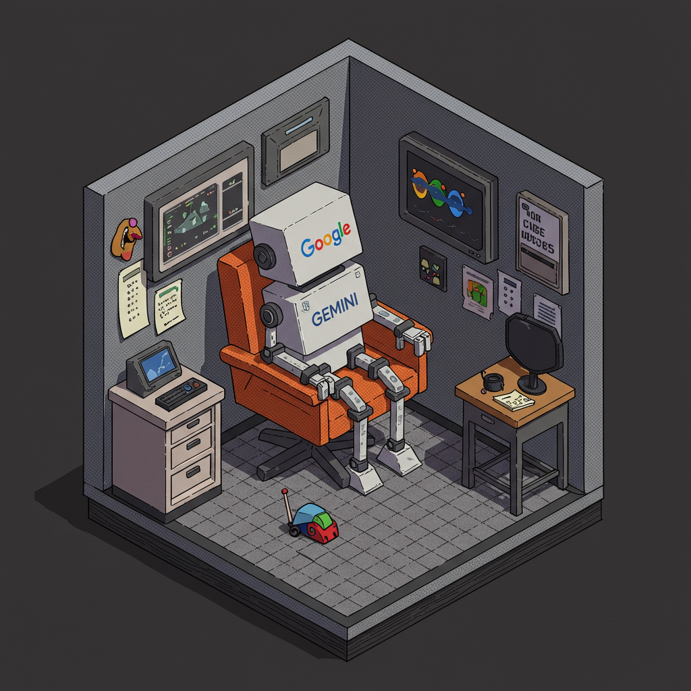

    preview do podcast

    <audio src="output/ep1-podcast-guildadainterface.MP3" controls title="Podcast editado"></audio>

# Projeto Podcast Gerado por I.A.s

 > ℹ️ **NOTE:** Este é o repositório desenvolvido durante o Bootcamp Microsoft 50 Anos - Prompts Inteligentes na plataforma DIO. Foi feito durante uma aula de Desafio da DIO(https://dio.me)

Projeto com o objetivo de gerar um podcast utilizando ferramentas de IA através de prompts mais trabalhados.

Utilizado uma esteira de prompts para gerar cada etapa do processo criativo.

## 💻 Tecnologias utilizadas no projeto

- [Gemini](https://gemini.google.com/app) 
- [ElevenLabs](https://beta.elevenlabs.io/)
- [Capcut](https://www.capcut.com/pt-br/)

## ✨ Como foi feito ?

- Roteiro gerado via Gemini
- Audio gerado pela elevenLabs
- Gemini Para gerar capas
- Capcut para tratar aúdio e adicionar sons de fundo

## 📚 Materiais passados pelo professor

- [Notion Template](https://helpful-jump-17b.notion.site/PAS-Podcast-AI-Studio-210489e15d7a4a73b743bb159e45d06f?pvs=4)
- [Editor de aúdio](https://www.capcut.com/editor?from_page=landing_page&__action_from=picture_V%C3%ADdeos%20profissionais%20em%20minutos,%20n%C3%A3o%20em%20horas.)

## 🛠️ Instruções de execução

Utilize os prompts para criar um podcast de maneira automatizada, para isso siga o passo a passo abaixo.

- 🤖 1. Use os prompts de roteiro no `Gemini`
- 🤖 2. Use os prompts de roteiro gerados pelo Gemini no `ElevenLabs`
- 🤖 3. Use os prompts de artes no `Gemini`
